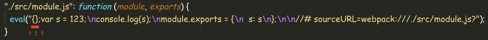
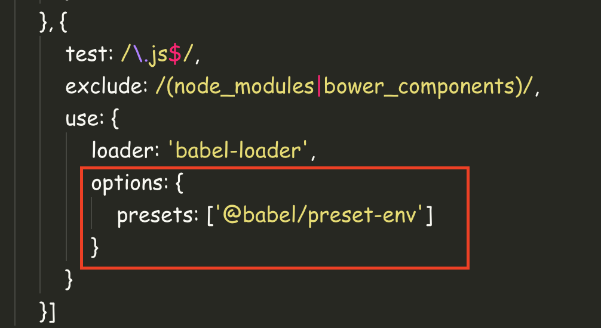
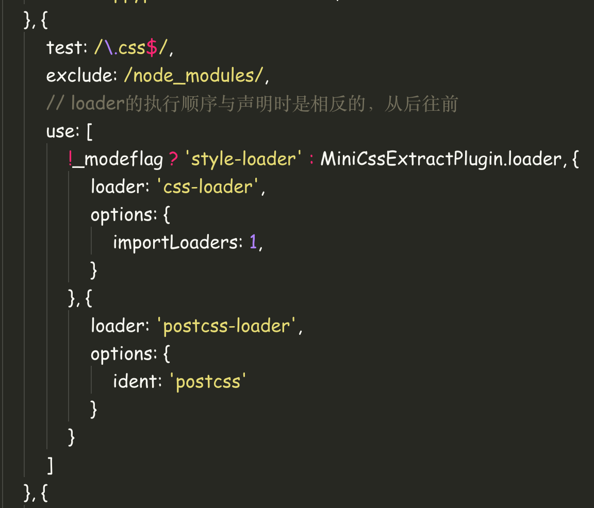

# 编写自定义webpack loader

随着前端工程化的不断发展，构建工具也在不断完善。作为大前端时代的新宠，webpack渐渐成为新时代前端工程师不可或缺的构建工具，随着webpack4的不断迭代，我们享受着构建效率不断提升带来的快感，配置不断减少的舒适，也一直为重写的构建事件钩子机制煞费苦心，为插件各种不兼容心灰意冷，虽然过程痛苦，但结果总是美好的。经历了一番繁琐的配置后，我常常会想，这样一个精巧的工具，在构建过程中做了什么？我也是抱着这样的好奇，潜心去翻阅相关书籍和官方文档，终于对其中原理有所了解，那么现在，就让我们一起来逐步揭开webpack这个黑盒的神秘面纱，探寻其中的运行机制吧。

本次webpack系列文章可参照项目：https://github.com/jerryOnlyZRJ/webpack-loader 。

本系列文章使用的webpack版本为4，如有其他版本问题可提issue或者直接在文章下方的评论区留言。

## 0.让webpack loader现出原型

在webpack中，真正起编译作用的便是我们的loader，也就是说，平时我们进行babel的ES6编译，SCSS、LESS等编译都是在loader里面完成的，在你不知道loader的本质之前你一定会觉得这是个很高大上的东西，正如计算机学科里的编译原理一样，里面一定有许多繁杂的操作。但实际上，loader只是一个普通的funciton，他会传入匹配到的文件内容(String)，你只需要对这些字符串做些处理就好了。一个最简单的loader大概是这样：

```js
/**
 * loader Function
 * @param {String} content 文件内容
 */
module.exports = function(content){
    return "{};" + content
}
```

使用它的方式和`babel-loader`一样，只需要在`webpack.config.js`的`module.rules`数组里加上这么一个对象就好了：

```js
{
    test: /\.js$/,
    exclude: /node_modules/,
       use: {
           //这里是我的自定义loader的存放路径
           loader: path.resolve('./loaders/index.js'),
           options: {
              test: 1
           }
       }
}
```

这样，loader会去匹配所有以`.js`后缀结尾的文件并在内容前追加`{};`这样一段代码，我们可以在输出文件中看到效果：



所以，拿到了文件内容，你想对字符串进行怎样得处理都由你自定义～你可以引入`babel`库加个 `babel(content)` ，这样就实现了编译，也可以引入`uglifyjs`对文件内容进行字符串压缩，一切工作都由你自己定义。

## 1.Loader实战常用技巧

### 1.1.拿到loader的用户自定义配置



在我们在`webpack.config.js`书写loader配置时，经常会见到 **options** 这样一个配置项，这就是webpack为用户提供的自定义配置，在我们的loader里，如果要拿到这样一个配置信息，只需要使用这个封装好的库 `loader-utils` 就可以了：

```js
const loaderUtils = require("loader-utils");

module.exports = function(content){
    // 获取用户配置的options
    const options = loaderUtils.getOptions(this);
    console.log('***options***', options)
    return "{};" + content
}
```

### 1.2.loader导出数据的形式

在前面的示例中，因为我们一直loader是一个Funtion，所以我们使用了return的方式导出loader处理后的数据，但其实这并不是我们最推荐的写法，在大多数情况下，我们还是更希望使用 `this.callback` 方法去导出数据。如果改成这种写法，示例代码可以改写为：

```js
module.exports = function(content){
    //return "{};" + content
    this.callback(null, "{};" + content)
}
```

`this.callback` 可以传入四个参数（其中后两个参数可以省略），他们分别是：

* error：Error | null，当loader出错时向外跑出一个Error
* content：String | Buffer，经过loader编译后需要导出的内容
* sourceMap：为方便调试生成的编译后内容的source map
* ast: 本次编译生成的AST静态语法树，之后执行的loader可以直接使用这个AST，可以省去重复生成AST的过程

### 1.3.异步loader

经过1.2我们可以发现，不论是使用`return`还是 `this.callback` 的方式，导出结果的执行都是同步的，假如我们的loader里存在异步操作，比如拉取请求等等又该怎么办呢？

熟悉ES6的朋友都知道最简单的解决方法便是封装一个**Promise**，然后用**async-await**完全无视异步问题，示例代码如下：

```js
module.exports = async function(content){
    function timeout(delay) {
        return new Promise((resolve, reject) => {
            setTimeout(() => {
                resolve("{};" + content)
            }, delay)
        })
    }
    const data = await timeout(1000)
    return data
}
```

但如果node的版本不够，我们还有原始的土方案 `this.async` ，调用这个方法会返回一个callback Function，在适当时候执行这个callback就可以了，上面的示例代码可以改写为：

```js
module.exports = function(content){
    function timeout(delay) {
        return new Promise((resolve, reject) => {
            setTimeout(() => {
                resolve("{};" + content)
            }, delay)
        })
    }
    const callback = this.async()
    timeout(1000).then(data => {
        callback(null, data)
    })
}
```

更老版本的node同此。

### 1.4.loaders的执行顺序

还记得我们配置CSS编译时写的loader嘛，它们是长这样的：



在很多时候，我们的 **use** 里不只有一个loader，这些loader的执行顺序是从后往前的，你也可以把它理解为这个loaders数组的出栈过程。

### 1.5.loader缓存

webpack增量编译机制会观察每次编译时的变更文件，在默认情况下，webpack会对loader的执行结果进行缓存，这样能够大幅度提升构建速度，不过我们也可以手动关闭它（虽然我不知道为什么要关闭它，既然留了这么个API就蛮介绍下吧，欢迎补充），示例代码如下：

```js
module.exports = function(content){
    //关闭loader缓存
    this.cacheable(false);
    return "{};" + content
}
```

### 1.6.pitch钩子全程传参

在loader文件里你可以exports一个命名为 **pitch** 的函数，它会先于所有的loader执行，就像这样：

```js
module.exports.pitch = (remaining, preceding, data) => {
    console.log('***remaining***', remaining)
    console.log('***preceding***', preceding)
    // data会被挂在到当前loader的上下文this上在loaders之间传递
    data.value = "test"
}
```

它可以接受三个参数，最重要的就是第三个参数data，你可以为其挂在一些所需的值，一个rule里的所有的loader在执行时都能拿到这个值。

```js
module.exports = function(content){
    //***this data*** test
    console.log('***this data***', this.data.value)
    return "{};" + content
}

module.exports.pitch = (remaining, preceding, data) => {
    data.value = "test"
}
```

## 2.总结

通过上述介绍，我们明白了，loader其实就是一个“平平无奇”的Funtion，能够传入本次匹配到的文件内容供我们自定义修改。