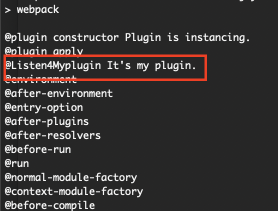
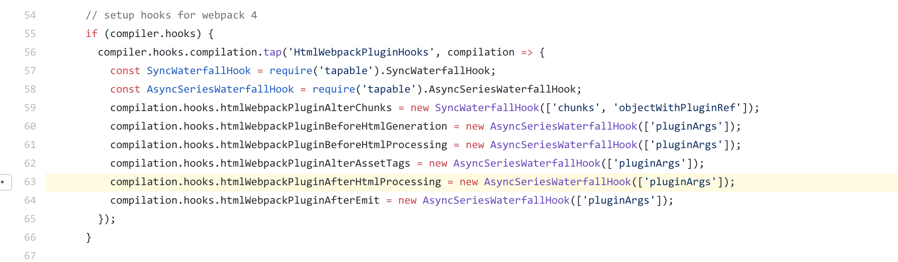
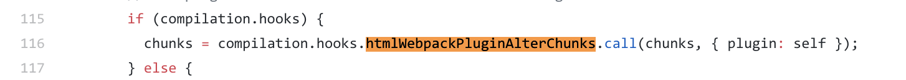
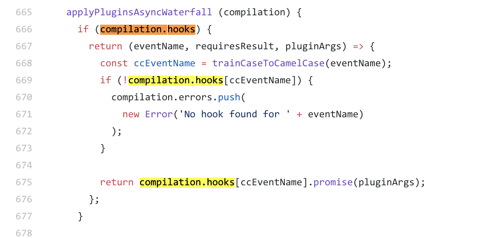

# 编写自定义webpack plugin

随着前端工程化的不断发展，构建工具也在不断完善。作为大前端时代的新宠，webpack渐渐成为新时代前端工程师不可或缺的构建工具，随着webpack4的不断迭代，我们享受着构建效率不断提升带来的快感，配置不断减少的舒适，也一直为重写的构建事件钩子机制煞费苦心，为插件各种不兼容心灰意冷，虽然过程痛苦，但结果总是美好的。经历了一番繁琐的配置后，我常常会想，这样一个精巧的工具，在构建过程中做了什么？我也是抱着这样的好奇，潜心去翻阅相关书籍和官方文档，终于对其中原理有所了解，那么现在，就让我们一起来逐步揭开webpack这个黑盒的神秘面纱，探寻其中的运行机制吧。

本次webpack系列文章可参照项目：https://github.com/jerryOnlyZRJ/webpack-loader 。

本系列文章使用的webpack版本为4，如有其他版本问题可提issue或者直接在文章下方的评论区留言。

## 0.温习一下webpack事件流

还记得我们在[《Webpack运行机制》](webpack-principle.md)里面讲到的webpack事件流，你还记得webpack有哪些常用的事件吗？webpack插件起到的作用，就是为这些事件挂载回调，或者执行指定脚本。

我们在文章里也提到，webpack的事件流是通过 **Tapable** 实现的，它就和我们的EventEmit一样，是这一系列的事件的生成和管理工具，它的部分核心代码就像下面这样：

```js
class SyncHook{
    constructor(){
        this.hooks = [];
    }

    // 订阅事件
    tap(name, fn){
        this.hooks.push(fn);
    }

    // 发布
    call(){
        this.hooks.forEach(hook => hook(...arguments));
    }
}
```

在 [webpack hook](https://webpack.js.org/api/compiler-hooks/) 上的所有钩子都是 Tapable 的示例，所以我们可以通过 **tap** 方法监听事件，使用 **call** 方法广播事件，就像官方文档介绍的这样：

```js
compiler.hooks.someHook.tap(/* ... */);
```

几个比较常用的hook我们也已经在[《Webpack运行机制》](webpack-principle.md)里面介绍过了，如果大家不记得了，可以回过头再看看哦～

## 1.什么是webpack plugin

如果剖析webpack plugin的本质，它实际上和webpack loader一样简单，其实它只是一个带有apply方法的class。

```js
//@file: plugins/myplugin.js
class myPlugin {
    constructor(options){
        //用户自定义配置
        this.options = options
        console.log(this.options)
    }
    apply(compiler) {
        console.log("This is my first plugin.")
    }
}

module.exports = myPlugin
```

这样就实现了一个简单的webpack plugin，如果我们要使用它，只需要在`webpack.config.js` 里 `require` 并实例化就可以了：

```js
const MyPlugin = require('./plugins/myplugin-4.js')

module.exports = {
    ......,
    plugins: [
        new MyPlugin("Plugin is instancing.")
    ]
}
```

大家现在肯定也都想起来了，每次我们需要使用某个plugin的时候都需要new一下实例化，自然，实例过程中传递的参数，也就成为了我们的构造函数里拿到的options了。

而实例化所有plugin的时机，便是在webpack初始化所有参数的时候，也就是事件流开始的时候。所以，如果配合 `shell.js` 等工具库，我们就可以在这时候执行文件操作等相关脚本，这就是webpack plugin所做的事情。

如果你想在指定时机执行某些脚本，自然可以使用在webpack事件流上挂载回调的方法，在回调里执行你所需的操作。

## 2.Tapable新用

如果我们想赋予webpack事件流我们的自定义事件能够实现嘛？

答案当然是必须可以啊老铁！

自定义webpack事件流事件需要几步？四步：

* 引入Tapable并找到你想用的hook，**同步hook** or **异步hook** 在这里应有尽有 -> [webpack4.0源码分析之Tapable](https://juejin.im/post/5abf33f16fb9a028e46ec352)

  ```js
  const { SyncHook } = require("tapable");
  ```

* 实例化Tapable中你所需要的hook并挂载在compiler或compilation上

  ```js
  compiler.hooks.myHook = new SyncHook(['data'])
  ```

* 在你需要监听事件的位置tap监听

  ```js
  compiler.hooks.myHook.tap('Listen4Myplugin', (data) => {
      console.log('@Listen4Myplugin', data)
  })
  ```

* 在你所需要广播事件的时机执行call方法并传入数据

  ```js
  compiler.hooks.environment.tap(pluginName, () => {
         //广播自定义事件
         compiler.hooks.myHook.call("It's my plugin.")
  });
  ```

完整代码实现可以参考我在文章最前方贴出的项目，大概就是下面这样：

现在我的自定义插件里实例化一个hook并挂载在webpack事件流上

```js
// @file: plugins/myplugin.js
const pluginName = 'MyPlugin'
// tapable是webpack自带的package，是webpack的核心实现
// 不需要单独install，可以在安装过webpack的项目里直接require
// 拿到一个同步hook类
const { SyncHook } = require("tapable");
class MyPlugin {
    // 传入webpack config中的plugin配置参数
    constructor(options) {
        // { test: 1 }
        console.log('@plugin constructor', options);
    }

    apply(compiler) {
        console.log('@plugin apply');
        // 实例化自定义事件
        compiler.hooks.myPlugin = new SyncHook(['data'])

        compiler.hooks.environment.tap(pluginName, () => {
            //广播自定义事件
            compiler.hooks.myPlugin.call("It's my plugin.")
            console.log('@environment');
        });

        // compiler.hooks.compilation.tap(pluginName, (compilation) => {
            // 你也可以在compilation上挂载hook
            // compilation.hooks.myPlugin = new SyncHook(['data'])
            // compilation.hooks.myPlugin.call("It's my plugin.")
        // });
    }
}
module.exports = MyPlugin
```

在监听插件里监听我的自定义事件

```js
// @file: plugins/listen4myplugin.js
class Listen4Myplugin {
    apply(compiler) {
        // 在myplugin environment 阶段被广播
        compiler.hooks.myPlugin.tap('Listen4Myplugin', (data) => {
            console.log('@Listen4Myplugin', data)
        })
    }
}

module.exports = Listen4Myplugin
```

在webpack配置里引入两个插件并实例化

```js
// @file: webpack.config.js
const MyPlugin = require('./plugins/myplugin-4.js')
const Listen4Myplugin = require('./plugins/listen4myplugin.js')

module.exports = {
    ......,
    plugins: [
        new MyPlugin("Plugin is instancing."),
        new Listen4Myplugin()
    ]
}
```

输出结果就是这样：



我们拿到了call方法传入的数据，并且成功在environment时机里成功输出了。

## 3.实战剖析

来看一看已经被众人玩坏的 `html-webpack-plugin` ，我们发现在readme底部有这样一段demo：

```js
function MyPlugin(options) {
  // Configure your plugin with options...
}

MyPlugin.prototype.apply = function (compiler) {
  compiler.hooks.compilation.tap('MyPlugin', (compilation) => {
    console.log('The compiler is starting a new compilation...');

    compilation.hooks.htmlWebpackPluginAfterHtmlProcessing.tapAsync(
      'MyPlugin',
      (data, cb) => {
        data.html += 'The Magic Footer'

        cb(null, data)
      }
    )
  })
}

module.exports = MyPlugin
```

如果你认真读完了上个板块的内容，你会发现，这个 `htmlWebpackPluginAfterHtmlProcessing` 不就是这个插件自己挂载在webpack事件流上的自定义事件嘛，它会在生成输出文件准备注入HTML时调用你自定义的回调，并向回调里传入本次编译后生成的资源文件的相关信息以及待注入的HTML文件的内容（字符串形式）供我们自定义操作。在项目搜一下这个钩子：



这不和我们在2.0里说的一样嘛，先实例化我们所需要的hook，从名字就可以看出来只有第一个是同步钩子，另外几个都是异步钩子。然后再找找事件的广播：





和我们刚刚介绍的一模一样对吧，只不过异步钩子使用promise方法去广播，其他不就完全是我们自定义事件的流程。大家如果有兴趣可以去打下console看看 `htmlWebpackPluginAfterHtmlProcessing` 这个钩子向回调传入的数据，或许你能发现一片新大陆哦。