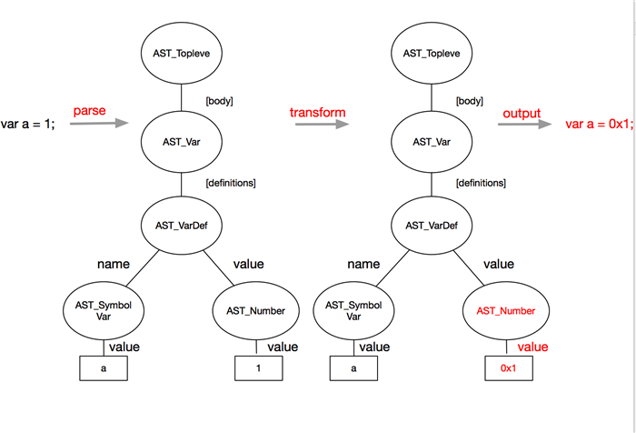
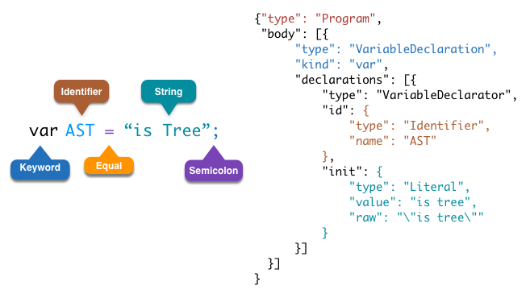

# Webpack运行机制

随着前端工程化的不断发展，构建工具也在不断完善。作为大前端时代的新宠，webpack渐渐成为新时代前端工程师不可或缺的构建工具，随着webpack4的不断迭代，我们享受着构建效率不断提升带来的快感，配置不断减少的舒适，也一直为重写的构建事件钩子机制煞费苦心，为插件各种不兼容心灰意冷，虽然过程痛苦，但结果总是美好的。经历了一番繁琐的配置后，我常常会想，这样一个精巧的工具，在构建过程中做了什么？我也是抱着这样的好奇，潜心去翻阅相关书籍和官方文档，终于对其中原理有所了解，那么现在，就让我们一起来逐步揭开webpack这个黑盒的神秘面纱，探寻其中的运行机制吧。

本次webpack系列文章可参照项目：https://github.com/jerryOnlyZRJ/webpack-loader 。

本系列文章使用的webpack版本为4，如有其他版本问题可提issue或者直接在文章下方的评论区留言。

## 1.webpack运行机制概述

在阅读本文之前，我就默认电脑前的你已经掌握了webpack的基本配置，能够独立搭建一款基于webpack的前端自动化构建体系，所以这篇文章不会教你如何配置或者使用webpack，自然具体概念我就不做介绍了，直面主题，开始讲解webpack原理。

webpack的运行过程可以简单概述为如下流程：

**初始化配置参数 -> 绑定事件钩子回调 -> 确定Entry逐一遍历 -> 使用loader编译文件 -> 输出文件**

接下来，我们将对具体流程逐一介绍。

## 2.webpack运行流程

### 2.1.webpack事件流初探

在分析webpack运行流程时，我们可以借助一个概念，便是webpack的事件流机制。

什么是webpack事件流？

*Webpack 就像一条生产线，要经过一系列处理流程后才能将源文件转换成输出结果。 这条生产线上的每个处理流程的职责都是单一的，多个流程之间有存在依赖关系，只有完成当前处理后才能交给下一个流程去处理。 插件就像是一个插入到生产线中的一个功能，在特定的时机对生产线上的资源做处理。*
*Webpack 通过 Tapable 来组织这条复杂的生产线。 Webpack 在运行过程中会广播事件，插件只需要监听它所关心的事件，就能加入到这条生产线中，去改变生产线的运作。 Webpack 的事件流机制保证了插件的有序性，使得整个系统扩展性很好。     --吴浩麟《深入浅出webpack》*

我们将webpack事件流理解为webpack构建过程中的一系列事件，他们分别表示着不同的构建周期和状态，我们可以像在浏览器上监听click事件一样监听事件流上的事件，并且为它们挂载事件回调。我们也可以自定义事件并在合适时机进行广播，这一切都是使用了webpack自带的模块 `Tapable` 进行管理的。我们不需要自行安装 `Tapable` ，在webpack被安装的同时它也会一并被安装，如需使用，我们只需要在文件里直接 `require` 即可。

Tapable的原理其实就是我们在前端进阶过程中都会经历的EventEmit，通过发布者-订阅者模式实现，它的部分核心代码可以概括成下面这样：

```js
class SyncHook{
    constructor(){
        this.hooks = [];
    }

    // 订阅事件
    tap(name, fn){
        this.hooks.push(fn);
    }

    // 发布
    call(){
        this.hooks.forEach(hook => hook(...arguments));
    }
}
```

Tapable的具体内容可以参照文章：[《webpack4.0源码分析之Tapable》](https://juejin.im/post/5abf33f16fb9a028e46ec352) 。其使用方法我们会在文章  [《编写自定义webpack plugin》 ](webpack-plugin.md)再做深入介绍。

因为webpack4重写了事件流机制，所以如果我们翻阅 [webpack hook](https://webpack.js.org/api/compiler-hooks/) 的官方文档会发现信息特别繁杂，但是在实际使用中，我们只需要记住几个重要的事件就足够了。

### 2.2.webpack运行流程详解

在讲解webpack流程之前先附上一张我自己绘制的执行流程图：


* 首先，webpack会读取你在命令行传入的配置以及项目里的 `webpack.config.js` 文件，初始化本次构建的配置参数，并且执行配置文件中的插件实例化语句，生成Compiler传入plugin的apply方法，为webpack事件流挂上自定义钩子。
* 接下来到了entryOption阶段，webpack开始读取配置的Entries，递归遍历所有的入口文件
* Webpack进入其中一个入口文件，开始compilation过程。先使用用户配置好的loader对文件内容进行编译（buildModule），我们可以从传入事件回调的compilation上拿到module的resource（资源路径）、loaders（经过的loaders）等信息；之后，再将编译好的文件内容使用acorn解析生成AST静态语法树（normalModuleLoader），分析文件的依赖关系逐个拉取依赖模块并重复上述过程，最后将所有模块中的`require`语法替换成`__webpack_require__`来模拟模块化操作。
* emit阶段，所有文件的编译及转化都已经完成，包含了最终输出的资源，我们可以在传入事件回调的`compilation.assets` 上拿到所需数据，其中包括即将输出的资源、代码块Chunk等等信息。

### 2.3.什么是AST?

在2.2中，我们看到了一个陌生的字眼——AST，上网一搜：

*在计算机科学中，抽象语法树（Abstract Syntax Tree，AST），或简称语法树（Syntax tree），是源代码语法结构的一种抽象表示。它以树状的形式表现编程语言的语法结构，树上的每个节点都表示源代码中的一种结构。之所以说语法是“抽象”的，是因为这里的语法并不会表示出真实语法中出现的每个细节。比如，嵌套括号被隐含在树的结构中，并没有以节点的形式呈现；而类似于 if-condition-then 这样的条件跳转语句，可以使用带有两个分支的节点来表示。  --维基百科*

其实，你只要记着，AST是一棵树，像这样：



转换成AST的目的就是将我们书写的字符串文件转换成计算机更容易识别的数据结构，这样更容易提取其中的关键信息，而这棵树在计算机上的表现形式，其实就是一个单纯的Object。



示例是一个简单的声明赋值语句，经过AST转化后各部分内容的含义就更为清晰明了了。

### 2.4.webpack输出结果解析

接下来，我们来看看webpack的输出内容。如果我们没有设置splitChunk，我们只会在dist目录下看到一个main.js输出文件，过滤掉没用的注释还有一些目前不需要去考虑的Funciton，得到的代码大概是下面这样：

```js
(function (modules) {
  //  缓存已经加载过的module的exports
  //  module在exports之前还是有js需要执行的，缓存的目的就是优化这一过程
  // The module cache
  var installedModules = {};

  // The require function
  /**
   * 模拟CommonJS require()
   * @param {String} moduleId 模块路径
   */
  function __webpack_require__(moduleId) {

    // Check if module is in cache
    if (installedModules[moduleId]) {
      return installedModules[moduleId].exports;
    }
    // Create a new module (and put it into the cache)
    var module = installedModules[moduleId] = {
      i: moduleId,
      l: false,
      exports: {}
    };

    // 执行单个module JS Function并填充installedModules与module
    // function mudule(module, __webpack_exports__[, __webpack_require__])
    // Execute the module function
    modules[moduleId].call(module.exports, module, module.exports, __webpack_require__);

    // Flag the module as loaded
    module.l = true;

    // Return the exports of the module
    return module.exports;
  }

  // expose the modules object (__webpack_modules__)
  __webpack_require__.m = modules;

  // expose the module cache
  __webpack_require__.c = installedModules;

 ......

  // __webpack_public_path__
  __webpack_require__.p = "";

  // 加载Entry并返回Entry的exports
  // Load entry module and return exports
  return __webpack_require__(__webpack_require__.s = "./src/index.js");
})
  // modules其实就是一个对象，键是模块的路径，值就是模块的JS Function
  ({
    "./src/index.js": function (module, __webpack_exports__, __webpack_require__) {
      "use strict";
      eval("__webpack_require__.r(__webpack_exports__);\n/* harmony import */ var _module_js__WEBPACK_IMPORTED_MODULE_0__ = __webpack_require__(/*! ./module.js */ \"./src/module.js\");\n/* harmony import */ var _module_js__WEBPACK_IMPORTED_MODULE_0___default = /*#__PURE__*/__webpack_require__.n(_module_js__WEBPACK_IMPORTED_MODULE_0__);\n{};\nconsole.log(_module_js__WEBPACK_IMPORTED_MODULE_0___default.a.s);\n\n//# sourceURL=webpack:///./src/index.js?");
    },
    "./src/module.js": function (module, exports) {
      eval("{};var s = 123;\nconsole.log(s);\nmodule.exports = {\n  s: s\n};\n\n//# sourceURL=webpack:///./src/module.js?");
    }
  });
```

我们都知道其实webpack在浏览器实现模块化的本质就是将所有的代码都注入到同一个JS文件里，现在我们可以清晰明了地看出webpack最后生成的也不过只是一个IIFE，我们引入的所有模块都被一个function给包起来组装成一个对象，这个对象作为IIFE的实参被传递进去。

但如果我们配置了splitChunk，这时候输出的文件就和你的Chunk挂钩了，代码也变了模样：

```js
 //@file: dist/common/runtime.js
 // 当配置了splitChunk之后，此时IIFE的形参modules就成了摆设，
 // 真正的module还有chunk都被存放在了一个挂载在window上的全局数组`webpackJsonp`上了
 (function(modules) { // webpackBootstrap
	 // install a JSONP callback for chunk loading
	 /**
	  * webpackJsonpCallback 处理chunk数据
	  * @param {Array} data  [[chunkId(chunk名称)], modules(Object), [...other chunks(所有需要的chunk)]]
	  */
 	function webpackJsonpCallback(data) {
        // chunk的名称，如果是entry chunk也就是我们entry的key
 		var chunkIds = data[0];
        // 依赖模块
 		var moreModules = data[1];
 		var executeModules = data[2];

 		// add "moreModules" to the modules object,
 		// then flag all "chunkIds" as loaded and fire callback
 		var moduleId, chunkId, i = 0, resolves = [];
 		for(;i < chunkIds.length; i++) {
 			chunkId = chunkIds[i];
 			if(installedChunks[chunkId]) {
 				resolves.push(installedChunks[chunkId][0]);
 			}
 			installedChunks[chunkId] = 0;
 		}
 		for(moduleId in moreModules) {
 			if(Object.prototype.hasOwnProperty.call(moreModules, moduleId)) {
 				modules[moduleId] = moreModules[moduleId];
 			}
 		}
 		if(parentJsonpFunction) parentJsonpFunction(data);

 		while(resolves.length) {
 			resolves.shift()();
 		}

 		// add entry modules from loaded chunk to deferred list
 		deferredModules.push.apply(deferredModules, executeModules || []);

 		// run deferred modules when all chunks ready
 		return checkDeferredModules();
 	};
 	function checkDeferredModules() {
 		var result;
 		for(var i = 0; i < deferredModules.length; i++) {
 			var deferredModule = deferredModules[i];
 			var fulfilled = true;
 			for(var j = 1; j < deferredModule.length; j++) {
 				var depId = deferredModule[j];
 				if(installedChunks[depId] !== 0) fulfilled = false;
 			}
 			if(fulfilled) {
 				deferredModules.splice(i--, 1);
 				result = __webpack_require__(__webpack_require__.s = deferredModule[0]);
 			}
 		}
 		return result;
 	}

 	// The module cache
 	var installedModules = {};

	// 缓存chunk，同理module
 	// object to store loaded and loading chunks
 	// undefined = chunk not loaded, null = chunk preloaded/prefetched
 	// Promise = chunk loading, 0 = chunk loaded
 	var installedChunks = {
 		"common/runtime": 0
 	};

 	var deferredModules = [];

 	// The require function
 	function __webpack_require__(moduleId) {
 		// Check if module is in cache
 		if(installedModules[moduleId]) {
 			return installedModules[moduleId].exports;
 		}
 		// Create a new module (and put it into the cache)
 		var module = installedModules[moduleId] = {
 			i: moduleId,
 			l: false,
 			exports: {}
 		};
 		// Execute the module function
 		modules[moduleId].call(module.exports, module, module.exports, __webpack_require__);
 		// Flag the module as loaded
 		module.l = true;
 		// Return the exports of the module
 		return module.exports;
 	}


 	// expose the modules object (__webpack_modules__)
 	__webpack_require__.m = modules;

 	// expose the module cache
 	__webpack_require__.c = installedModules;

 	......

 	// __webpack_public_path__
 	__webpack_require__.p = "";

 	var jsonpArray = window["webpackJsonp"] = window["webpackJsonp"] || [];
 	var oldJsonpFunction = jsonpArray.push.bind(jsonpArray);
 	jsonpArray.push = webpackJsonpCallback;
 	jsonpArray = jsonpArray.slice();
 	for(var i = 0; i < jsonpArray.length; i++) webpackJsonpCallback(jsonpArray[i]);
 	var parentJsonpFunction = oldJsonpFunction;


 	// run deferred modules from other chunks
 	checkDeferredModules();
 })([]);
```

```js
//@file: dist/common/utils.js
(window["webpackJsonp"] = window["webpackJsonp"] || []).push([["common/utils"], {
  "./src/index.js": function (module, __webpack_exports__, __webpack_require__) {
    "use strict";
    eval("__webpack_require__.r(__webpack_exports__);\n/* harmony import */ var _module_js__WEBPACK_IMPORTED_MODULE_0__ = __webpack_require__(/*! ./module.js */ \"./src/module.js\");\n/* harmony import */ var _module_js__WEBPACK_IMPORTED_MODULE_0___default = /*#__PURE__*/__webpack_require__.n(_module_js__WEBPACK_IMPORTED_MODULE_0__);\n{};\nconsole.log(_module_js__WEBPACK_IMPORTED_MODULE_0___default.a.s);\n\n//# sourceURL=webpack:///./src/index.js?");
  },
  "./src/module.js": function (module, exports) {
    eval("{};var s = 123;\nconsole.log(s);\nmodule.exports = {\n  s: s\n};\n\n//# sourceURL=webpack:///./src/module.js?");
  }
}]);
```

这时候，IIFE的形参也变成了摆设，所有我们的模块都被放在了一个名为 **webpackJsonp** 的全局数组上，通过IIFE里的 `webpackJsonpCallback` 来处理数据。

## 3.总结

纵观webpack构建流程，我们可以发现整个构建过程主要花费时间的部分也就是递归遍历各个entry然后寻找依赖逐个编译的过程，每次递归都需要经历 **String->AST->String** 的流程，经过loader还需要处理一些字符串或者执行一些JS脚本，介于node.js单线程的壁垒，webpack构建慢一直成为它饱受诟病的原因。这也是happypack之所以能大火的原因，我们可以来看一段happypack的示例代码:

```js
// @file: webpack.config.js
const HappyPack = require('happypack');
const os = require('os');
// 开辟一个线程池
// 拿到系统CPU的最大核数，让happypack将编译工作灌满所有CPU核
const happyThreadPool = HappyPack.ThreadPool({ size: os.cpus().length });

module.exports = {
  // ...
  plugins: [
    new HappyPack({
      id: 'js',
      threadPool: happyThreadPool,
      loaders: [ 'babel-loader' ]
    }),

    new HappyPack({
      id: 'styles',
      threadPool: happyThreadPool,
      loaders: [ 'style-loader', 'css-loader', 'less-loader' ]
    })
  ]
};
```

大家如果有用过pm2的话就能很容易明白了，其实原理是一致的，都是利用了node.js原生的cluster模块去开辟多进程执行构建，不过在4之后大家就可以不用去纠结这一问题了，多进程构建已经被集成在webpack本身上了，除了增量编译，这也是4之所以能大幅度提升构建效率的原因之一。